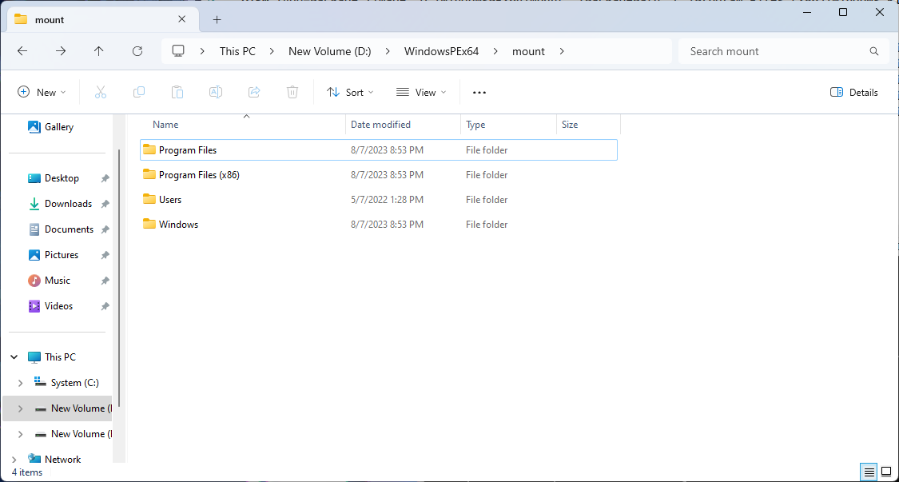
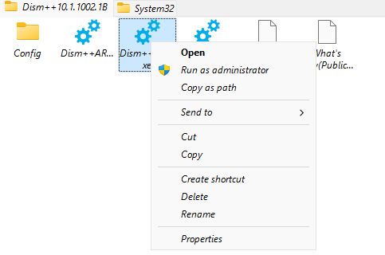
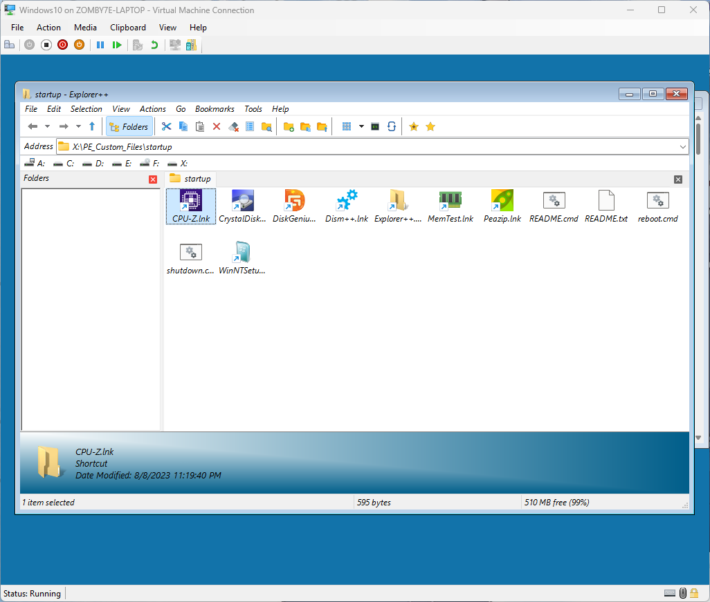

# 自制 Windows PE

[TOC]

> 手把手教你制作一个无后门，干净、方便的 Windows PE 镜像。

## 需求和预期

- 需求：我们需要 Windows 预安装环境是因为 Windows 安装镜像不能很好地进行分区工作，如果分区格式不正确，Windows 安装镜像内的向导会错误地显示「此电脑不兼容」。因此我们需要一个好用且可信任的 PE 镜像。
- 旧的 Windows PE 可能缺少网卡、触摸板等设备的驱动程式。
- 第三方 Windows PE 可能植入后门，可能包含盗版内容。
- 第三方英语 Windows PE 不支持中文显示。
- 预期：
  - 检查硬件信息
  - 修改磁盘分区
  - 系统部署/备份/维护
  - 文件管理
  - 正确读取中日韩文件路径
- 注意：此教程没有任何破解相关的内容，Windows PE 启动后 24 小时会自动关机（防止作为日常用操作系统），请注意这一点。

## 准备环境

- 虚拟机加 SMB 服务器
  - 或者一个至少 1G 的 USB 存储设备
- 已安装 [Windows ADK](https://learn.microsoft.com/en-us/windows-hardware/get-started/adk-install) 的电脑
- 自己需要的程序，比如第三方分区工具等

## 制作步骤

### 1. 安装 ADK 并准备修改

先在微软的官方文档里找到 Windows ADK 的下载链接。

安装 ADK 后请选择要进行修改和存储镜像的路径（请修改下面的代码再执行）。在 cmd 执行下面的命令可以释放 Windows PE 的镜像内容。*arm 本人尚未测试。*

```cmd
:: First step
copype amd64 D:\WindowsPEx64
```

释放镜像之后还不可以修改，需要先挂载镜像：

```cmd
Dism /Mount-Image /ImageFile:"D:\WindowsPEx64\media\sources\boot.wim" /index:1 /MountDir:"D:\WindowsPEx64\mount"
```

我的挂在路径是 `D:\WindowsPEx64\mount`，打开这个路径后会展示出类似于 Windows C 盘的目录结构，现在已经可以添加你自己的工具了。



### 2. 修改开机自启脚本

在 PE 系统的根目录添加任意名称的资料夹，稍后的修改都基于此处。（我的是 `PE_Custom_Files`，因为要用来存放自己喜欢的工具，所以后面统称为**工具路径**）

要制作一个客制化的 PE 系统，少不了简单好用的图形程序，还需要再开机时启动它。

决定开机要自动执行什么程式有两种方案，`winpeshl.ini` 用于开机时启动指定程式，`startnet.cmd` 则为开机执行的脚本。我们直接使用后者。

先打开 PE 系统根目录下的 `Windows\System32\startnet.cmd` 这个文件，如果没有请创建，内容如下：

```cmd
wpeinit
powercfg /s 8c5e7fda-e8bf-4a96-9a85-a6e23a8c635c
X:\PE_Custom_Files\startup.cmd
```

- `wpeinit` 这个命令会自动初始化系统（检测硬件、网路等），不需要修改。
- 第二行代码用于确保高性能模式。
- 第三行的解释：在工具路径内新建任意名称的脚本，我的是 `startup.cmd`，然后在 `startnet.cmd` 执行它，这么做是为了方便后续的修改（你也可以不这么做，把后面要加的命令写在这个文件内也行）。

### 3. 添加你喜欢的小工具

下载你喜欢的小工具的便携版（注意不要下载安装包），解压到工具路径内，完成后看起来像这样：


注意要在工具路径下面新建一个任意名称的资料夹，当作刚开机时的「桌面资料夹」使用。

你应该至少添加一个文件管理器（因为系统不再自带），我这里使用的是 [Explorer++](https://explorerplusplus.com/download), 把它放在工具路径内，然后在开机脚本启动它，参数填写你刚刚新建的「桌面资料夹」。例子：

```cmd
X:\PE_Custom_Files\explorerpp_x64\Explorer++.exe, "X:\PE_Custom_Files\startup\"
```

为了观感，你需要带图标的快捷方式，但是目前还不可以创建，后续步骤会介绍。下面是各个工具的详细信息，请酌情添加：

- 硬件信息
  - [CPU-Z](https://www.cpuid.com/softwares/cpu-z.html) (免费/专有软体) 查看处理器、显卡、内存等信息。
  - [CrystalDiskInfo](https://crystalmark.info/en/software/crystaldiskinfo/) (免费/开源/推荐) 查看硬碟信息的工具。（常用来查看 SSD 寿命）
  - [MemTest](https://www.techpowerup.com/memtest64/) (免费/开源/推荐) 内存测试工具。
- 分区工具
  - [DiskGenius](https://www.diskgenius.com/) (基础功能免费/闭源) 有分区、数据备份、恢复等功能。这个工具需要普通 Windows 系统的一个 DLL, 如果你它到 DiskGenius 的目录下，就可以正常运行。但是请注意，如果二次发布这些专有软体（包括 DiskGenius 和系统的 DLL），可能会违法用户协议，具体请以相关软件的协议文件为准。
  - [Diskpart](https://learn.microsoft.com/zh-cn/windows-server/administration/windows-commands/diskpart) (提醒你它是系统自带的，不需要添加) 强大的分区工具，但是没有图形界面，如果你会，就不推荐别的。
- 系统部署
  - [Dism++](https://github.com/Chuyu-Team/Dism-Multi-language) (免费/开源/推荐) 可以用来备份和部署系统，优化系统的强大工具。
  - WinNTSetup (免费/专有)  发布于某论坛，请自行搜索，算是大家比较常用的系统安装工具。
  - Windows 安装媒介里面的 exe 文件 (提醒你其实你可以不用别的工具，但是得提前解压 Windows 安装镜像) 

- 档案管理员
  - [Explorer++](https://explorerplusplus.com/download) (免费/开源/推荐) 开源的强大的文件管理器。
  - [PeaZip](https://peazip.github.io/) (免费/开源/推荐) 优雅美观的归档管理员，我知道 7-Zip 很好用但它和系统不相容。

### 4. ADK 额外配置项目

- 中日韩字体 (推荐添加)

  ```cmd
  :: Add fonts
  Dism /Add-Package /Image:"D:\WindowsPEx64\mount" /PackagePath:"C:\Program Files (x86)\Windows Kits\10\Assessment and Deployment Kit\Windows Preinstallation Environment\amd64\WinPE_OCs\WinPE-FontSupport-ZH-CN.cab"
  Dism /Add-Package /Image:"D:\WindowsPEx64\mount" /PackagePath:"C:\Program Files (x86)\Windows Kits\10\Assessment and Deployment Kit\Windows Preinstallation Environment\amd64\WinPE_OCs\WinPE-FontSupport-ZH-HK.cab"
  Dism /Add-Package /Image:"D:\WindowsPEx64\mount" /PackagePath:"C:\Program Files (x86)\Windows Kits\10\Assessment and Deployment Kit\Windows Preinstallation Environment\amd64\WinPE_OCs\WinPE-FontSupport-ZH-TW.cab"
  Dism /Add-Package /Image:"D:\WindowsPEx64\mount" /PackagePath:"C:\Program Files (x86)\Windows Kits\10\Assessment and Deployment Kit\Windows Preinstallation Environment\amd64\WinPE_OCs\WinPE-FontSupport-JA-JP.cab"
  Dism /Add-Package /Image:"D:\WindowsPEx64\mount" /PackagePath:"C:\Program Files (x86)\Windows Kits\10\Assessment and Deployment Kit\Windows Preinstallation Environment\amd64\WinPE_OCs\WinPE-FontSupport-KO-KR.cab"
  ```

- 添加 Windows PowerShell 支援

  命令太长，碍于篇幅并且它也不太实用，你可以参考[官方文档](https://learn.microsoft.com/zh-cn/windows-hardware/manufacture/desktop/winpe-adding-powershell-support-to-windows-pe?view=windows-11)进行添加。也可以用 `busybox`.

- Dotnet
  如果你需要添加的程序需要 Dotnet 运行时，请参考[官方文档](https://learn.microsoft.com/zh-cn/windows-hardware/manufacture/desktop/winpe-add-packages--optional-components-reference?view=windows-11)进行添加。

- 添加更多驱动程式或者 x64 模拟，请参考[官方文档](https://learn.microsoft.com/en-us/windows/deployment/customize-boot-image?tabs=command-line#step-5-add-drivers-to-boot-image-optional)。

### 5. Busybox

下载 [Busybox](https://frippery.org/busybox/), 把那个文件放在你的 PE 系统的 `Windows\system32\` 路径下，无需其他修改。

你可以用它下载网路上的文件，或者搭建临时伺服器来传输文档。

### 6. 封装和制作

**每次修改之前请先挂载再修改，每次修改之后请先取消挂载再封装。**

用以下命令会取消挂载并且封装镜像。

```cmd
:: Unmount and commit
Dism /Unmount-Image /MountDir:D:\WindowsPEx64\mount /Commit

:: Make bootable iso file
MakeWinPEMedia /ISO "D:\WindowsPEx64" D:\winpe64.iso
```

### 7. 测试和完善

将封装好的镜像烧写到 USB 设备(文章后面会详细介绍)，或者用虚拟机启动它。

测试你的工具能否运行，还要注意的是 CrystalDiskInfo 等涉及底层硬件的程式可能无法以预期的状况运行，因此建议至少进行一次真机测试。

打开工具路径，为你想要启动的每一个小工具创建快捷方式，并且放到之前建立的 `startup` 资料夹内，因为这个资料夹开机就会打开，所以当作「桌面资料夹」来使用。*很遗憾没什么更好的创建方法了……*



记得把快捷方式复制出来，可以透过 USB 设备、电脑上的文件系统或者 SMB 网路传输。一定要复制出来，PE 系统的内容无法保存。

然后**重复地进行这些步骤直到满意为止：挂载镜像、替换不相容的程式、卸载镜像并封装、重新运行。**

最后的收尾工作还要在 `startup` 资料夹内添加关机脚本、重启脚本和文档避免用户不会使用甚至不会关机：

- shutdown.cmd

  ```cmd
  wpeutil shutdown
  ```

- reboot.cmd

  ```cmd
  wpeutil reboot
  ```

- readme.cmd

  ```cmd
  :: You cannot open txt files by double-click
  notepad readme.txt
  ```

- readme.txt 是你的文档

  ```text
  Wecome to using my PE system.
  If you want to xxx, you should...
  ```

*或许你还想换个好看的壁纸什么的，随便。*

## 最终成果



## 可能出现的问题

### SMB Client

在 Explorer++ 里输入 ip 地址，双反斜杠开头，就像：

```text
\\192.168.1.1\my_folder
```

输入账户名一定义像这样（点加反斜杠开头）

```text
.\user
```

### 关机/重启

关机和重启的命令与常见的 Windows 版本不同，请点击脚本来关机或者重启，关掉所有窗口就会自动重启。开机时长达到 24 小时自动关机。

### 如何启动 Powershell/Busybox

点击 Explorer++ 上面的「命令列」按钮（黑色的方块）。

在新的窗口输入 `powershell` 或者 `busybox` 即可。

### 遵守相关软件许可

对一些私有软体进行二次发布可能违反相关法律/法规，具体情况会比较复杂，请自行参考。