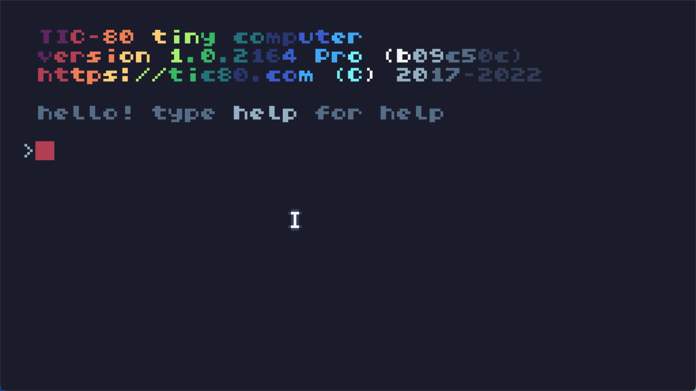
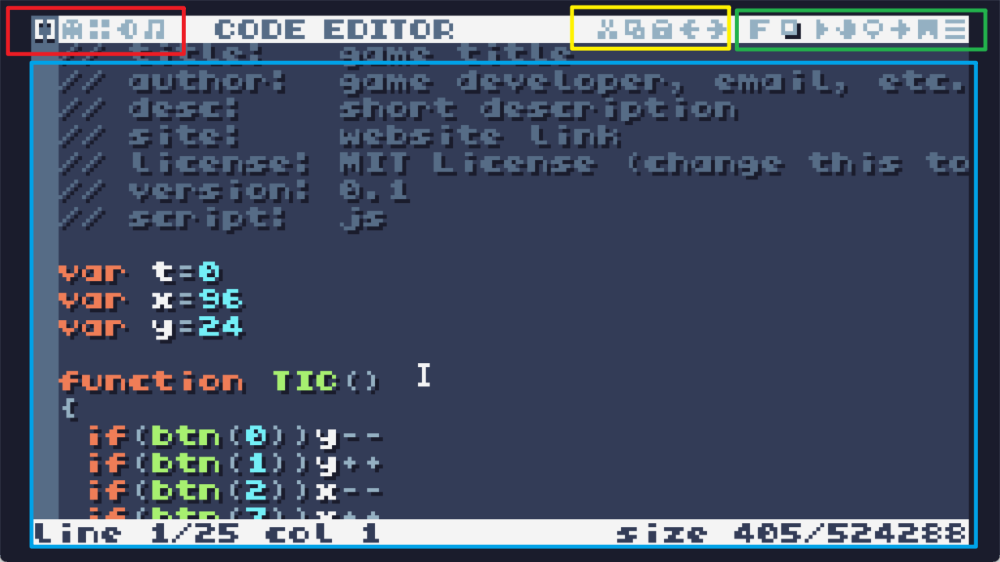
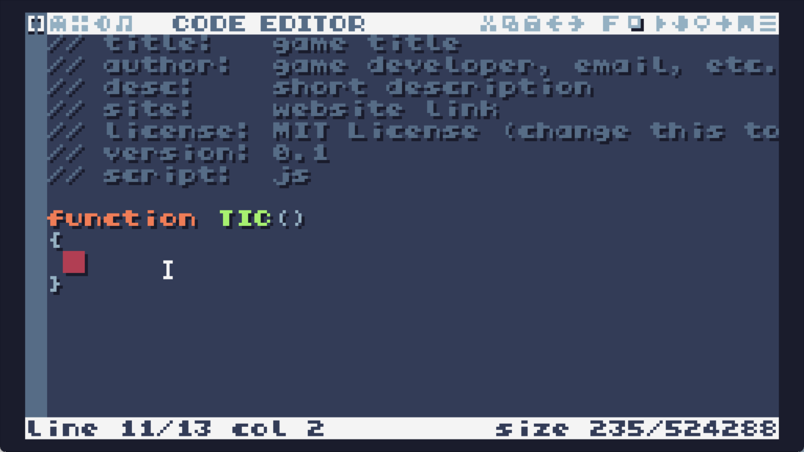
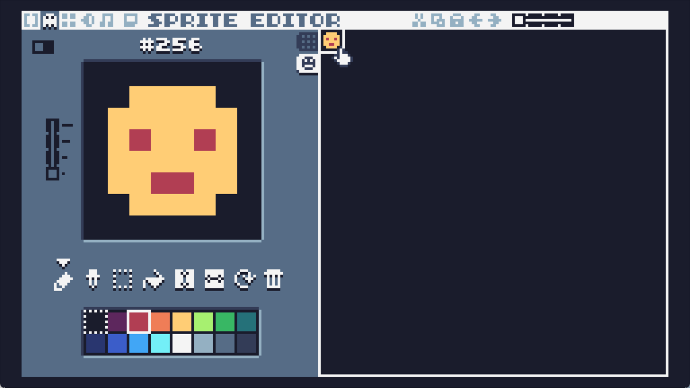
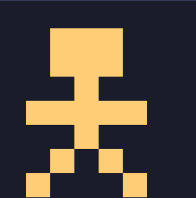

[TOC]

## 简单介绍

[官网](https://tic80.com/) 介绍它是一款免费开源的奇幻计算机，可以游玩游戏也可用于制作。它内置了代码、音频、地图编辑器等，没错，你可以在这个“游戏机”里写代码。

写好的游戏可以发布到互联网分享给大家。

## 快速上手

> 简单介绍后，如果你感兴趣应该已经安装好了，我来介绍下它的基本用法：如何打开游戏，如何找，如何游玩下载的游戏。

当你迫不及待地安装 TIC-80 后也许会奇怪，你只能看到一个计算机终端，它什么也不做。



输入 `help` 看到的帮助信息似乎不够用，不过按照下面步骤就可以玩到它内置的游戏（不用担心，这是游戏，没有任何 Linux 命令和 DOS 命令）。

1. 输入 `ls` 或者 `dir` 看看有什么游戏可以玩，但是默认情况下没有。
2. 输入 `demo` 释放它自带的游戏，再 `ls` 即可看到。
3. 加载你想玩的游戏，比如输入 `load car.tic` （文件名可以用 tab 键补全）
4. 加载游戏文件后就可以游玩或者开发这个游戏了，如果想直接玩，按下输入 `run` 就可以运行它了。
5. 按下 `Esc` 或者手机的返回键就可以进入游戏菜单，点击 Close Game 即可退出。在游戏内的确认键是手柄 A 键或者电脑键盘 Z。手柄的按钮是 XYAB，电脑是 ASZX。现在你可以试试它自带的俄罗斯方块！
6. 你可以在官网的网页在线游玩 TIC-80 游戏，也可以在 itch.io 网站上体验或者下载由 TIC-80 开发的游戏。当你下载了 .tic 文件名结尾的游戏，你可以：
7. 在游戏内输入 `folder`，如果是电脑，会弹出存放游戏的文件夹，把 .tic 游戏文件拖拽进窗口就可以玩了。如果你下载了 zip 文件，需要先解压。

相关网站：

- 游戏发布网站 https://itch.io/games/made-with-tic-80
- 官网（也有发布游戏） https://tic80.com/
- 下载安卓版 https://f-droid.org/zh_Hans/packages/com.nesbox.tic/

## FAQ

- Q: TIC-80 pro 如何获取？我买不起怎么办？

  A: 专业版可以在 itch.io 花费 10 美元购买，如果无力负担购买费用，可以自己编译专业版，它是开源的。

- Q: 它是哪款主机的模拟器？

  A: TIC-80 没有模拟一款真实的游戏主机或者电脑，只是纯粹的游戏模拟器。游戏像素和容量像都老电脑一样，是非常受限制的。

## 来制作游戏！

> 需要你有 JavaScript 编程基础。至少要了解 if 语句等。

虽然 TIC-80 支持多种脚本语言，但是它支持大多数脚本语言都不太常见，我会 JS，在我接触 TIC-80 之前也只是听过 Lua 语言和 Ruby 语言，其他的都没听过。我们选最常见的 JS 语言吧。

虽然 TIC-80 支持多种外置编辑器，但是体验都很差，截至我写这篇博客的时候，VSCode 编辑器插件（没有上架 Open Vsx 唉？）还在用旧版的命令行参数，根本不能运行，所以先用内置编辑器吧……

经历一番妥协后，让我们新建一个游戏文件，在控制台输入：

```
new js
```

要注意 js 是编程语言，不是文件名。

### 认识编辑器界面

按下 `Esc` 键，所见如下就是代码编辑器界面：



- 红色为切换界面，分别是：代码编辑器、精灵编辑器、地图编辑器、音效和音乐编辑器。想回到终端按 `Esc` 即可，再次按 `Esc` 进入。

- 黄色：剪切、复制、粘贴、撤销、重做。（就是记事本常用的快捷键）。还支援双击选中整个单词、`Shift` + `Tab` 来更改缩进等操作，有语法高亮。

- 绿色：

  - 切换字体
  - 文字阴影
  - 运行(`Ctrl` + `R` 快捷键)
  - 拖拽
  - 搜索文本
  - 将编辑器跳转到某个行号（这玩意就不显示行号……奇葩）
  - 书签列表（点击代码框左侧添加一个书签）
  - 函数列表

- 蓝色：原始码编辑器，注释部分包含了游戏名、作者信息等。script 部分是编程语言的种类。


### 编程相关

  - `TIC()` 是循环执行的主函数，每秒执行 60 次。
  - JS 语言只能用 `var` 声明变量，因为标准只支援到 ES5，这意味着你不能用 let 或者 const 创建变量/常量。文件模块当然也不行了。
  - `cls()` 函数用于清除整个屏幕，通常要在主函数执行一次。
  - `print()` 函数用于输出文字。
  - `spr()` 函数用于创建精灵。
  - 不同于成熟的游戏引擎，你需要自己写跳跃、移动的逻辑，透过主函数的代码每秒 60 次运算再渲染到屏幕上。代码容量、游戏的分辨率、内存等都是受限制的。
  - 编程限制和 API 参考：https://github.com/nesbox/TIC-80/wiki

### 第一个程序

1. 将代码删除到只剩主函数，这个函数就是每秒执行60次的。

   

2. 点击到精灵设计页面，画一个自己的精灵！

   

   记住这个精灵的编号，在像素画上面，第一个精灵应该是 256 号。

3. 回到代码编辑器，在主函数调用 `cls()` 函数清除屏幕，再用 `spr()` 函数绘制精灵。

   ```js
   var x = 0
   var y = 0
   
   // 每秒运行 60 次
   function TIC()
   {
   	cls()	// 清除屏幕
   	spr(256, x, y)	//创建一个精灵，参数分别是精灵编号，x y 轴的位置。
   }
   ```

   这样游戏就会每秒 60 次不间断地进行清除屏幕、渲染一个精灵。

4. 现在精灵还不能动，我们需要添加一下运动的逻辑：

   ```js
   var x=0
   var y=0
   
   function TIC()
   {
   	cls()
   	if(btn(0))y--
   	if(btn(1))y++
   	if(btn(2))x--
   	if(btn(3))x++
   	spr(256, x, y)
   }
   ```

   最终成品如上所示，`btn()` 函数是检测按键是否被按住，参数是按键编号，0 1 2 3 分别是玩家1的上下左右按键。参考： https://github.com/nesbox/TIC-80/wiki/key-map

   如果检测到按键按下，玩家的坐标会根据按键变化，然后游戏按照新坐标渲染新的精灵。

5. 点击代码编辑器右上角的三角运行游戏，在控制台输入 `save learn` 就可以保存到文件， `learn.tic` 就是你刚刚写的游戏。

6. 现在我们已经完成了第一个程序了，如果你想限制精灵不要跑出屏幕，只需加入简单的逻辑限制精灵的坐标就行。游戏是限制 240x136 的分辨率的，小精灵最大只有 8x8，如果 x 坐标大于 `136 - 精灵像素数`，让坐标恢复成 `136 - 精灵像素数` ，写四个判断的逻辑就可以把精灵限制在屏幕内了。别忘了计算精灵的黑边的像素数。

   参考： https://github.com/nesbox/TIC-80/wiki#tic-80-tiny-computer

### 跳跃逻辑观赏

> 代码内有重力加速度的功能，x 轴只是简单地判断左右方向；y 轴则判断是否正在坠落，如果是则增加坠落速度，如果触底，把速度归零，如果触底并且按下跳跃键，则开始跳跃。

我参考的教学影片：https://www.youtube.com/watch?v=NgMCUacP1tA&list=PLOUbntoMeucFBoxH6-AkpyHA2DJ5oBSPB

预览影片：

<video src="2023-02-21 17-52-59.mp4"></video>

精灵参考：



我的代码参考：

```js
// script:  js
 
var player1 = {
	x: -1,
	y: 0,
	speed: 1,
	vx: 0,
	vy: 0
}
var gravity = 0.2

var location = ""

function TIC()
{
	cls()
	location = "x: " + Math.round(player1.x) + " y: " + Math.round(player1.y) + " speed: y: " + player1.vy.toFixed(2) + " x: " + player1.vx.toFixed(2)
	print(location)
	player1Move()
	limit()
	spr(256, player1.x, player1.y)
}

function player1Move() {
	// x-axis motion
	if(btn(2)){player1.vx = -player1.speed}
	else if(btn(3)){player1.vx = player1.speed}
	else {player1.vx = 0}
	// y-axis motion
	if (player1.vy == 0 && btnp(0)) {
		player1.vy = -2.5
	}
	else if (player1.y >= 128) {
		player1.vy = 0
	} else {
		player1.vy = player1.vy + gravity
	}
	// update position
	player1.x = player1.vx + player1.x
	player1.y = player1.vy + player1.y

}

function limit() {
	// Limit the range of activities 
	if (player1.y < -1) {
		player1.y = -1
	}
	if (player1.y > 128) {
		player1.y = 128
	}
	if (player1.x < -1) {
		player1.x = 234
	}
	if (player1.x > 234) {
		player1.x = -1
	}	
}
```

## 7E 的评价

控制台、旧电脑和像素游戏非常吸引我，不过刚安装时我甚至不明白它是做什么的，后来查了下才会用，用它开发游戏的逻辑也比较简单，一个这么小的软件能画像素画、编辑地图、写代码，分享创意，很有趣。

JS 编程语言的支持有点旧，希望能支持下 ES6 或者更高，外置编辑器的支持也不太好，如果我有能力我想开发一款。

买了专业版，捐助给开发者 10 美元，希望 TIC-80 发展得越来越好。